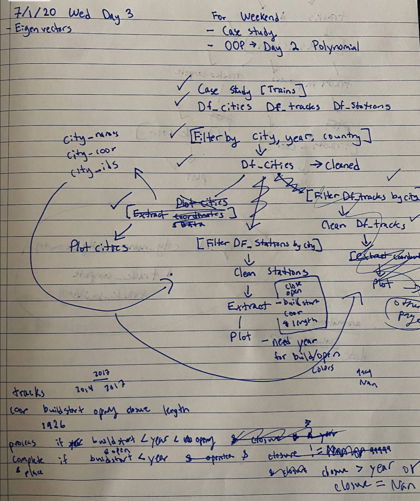
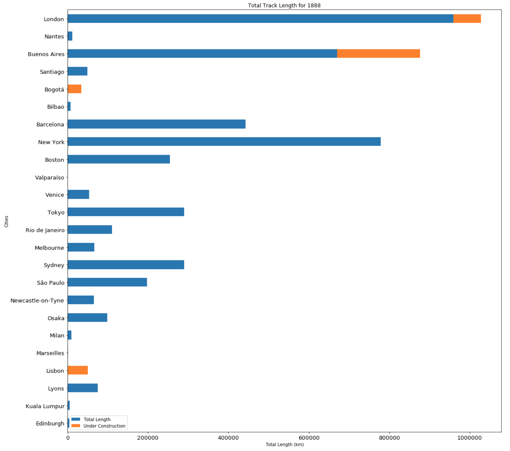
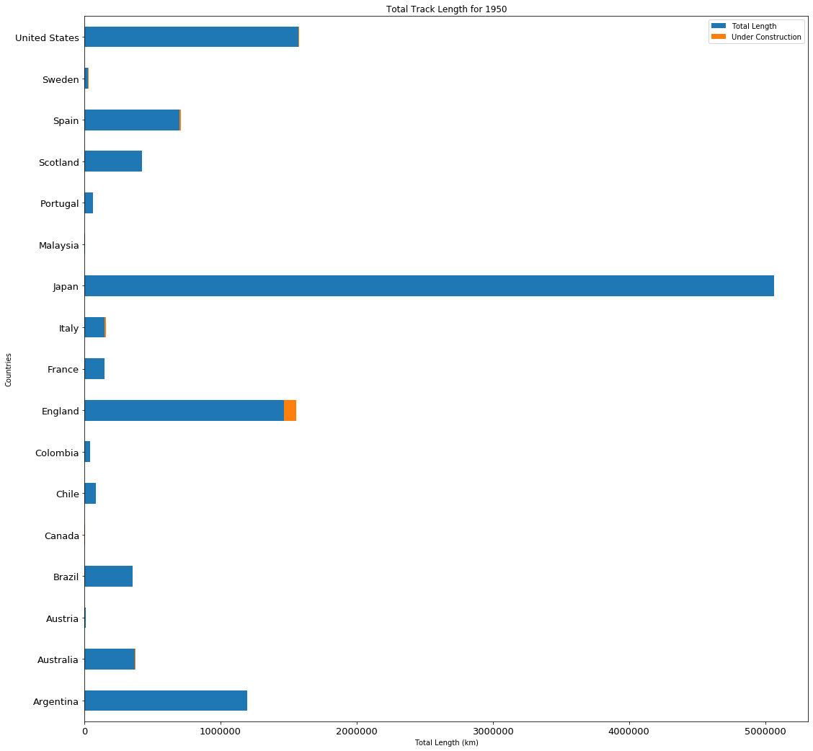
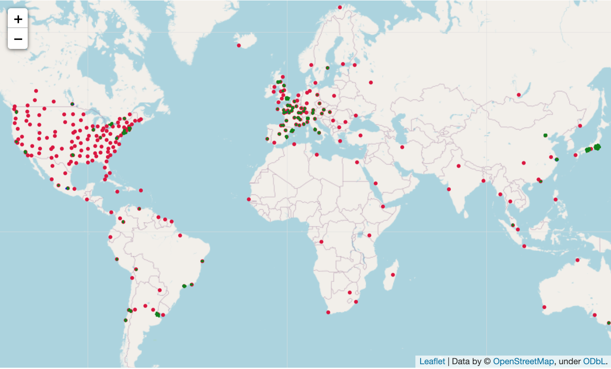
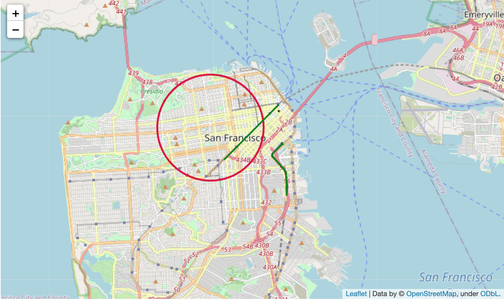
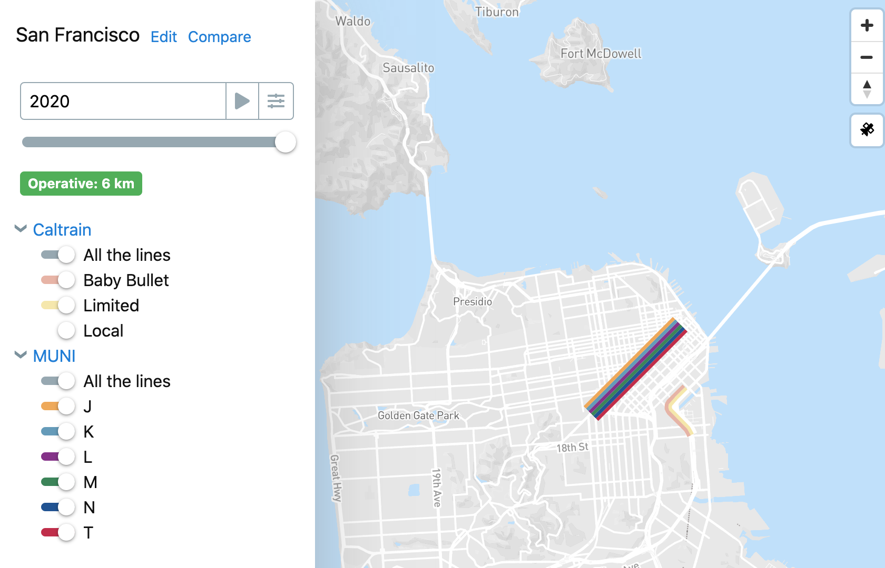

# Galvanize (Day 4) - Case Study
Transit Systems of the World - https://www.kaggle.com/citylines/city-lines

> Project Goals:
- Data clean and explore the world's transit systems from 1832 to 2017.
- Obtain insights and present visualizations of data.
---

### Table of Contents
- [Description](#description)
- [Data Understanding](#data-understanding)
- [Data Preparation](#data-preparation)
- [Models](#models)
- [Author-Info](#author-info)

---

## Description

What did the expansion of the London Underground, the world’s first underground railway which opened in 1863, look like? What about the transportation system in your home city? Citylines collects data on transportation lines across the world so you can answer questions like these and more.

This project will explore the dataset from Citylines that contains data on the worlds track systems from 1837 to 2017. The primary objective is to organize and clean the dataset in order to create a data analysis tool to help other users infer their own inights. A secondary objective would be to demonstrate the power of this data analysis tool to obtain insights and visualizations.

[Back To The Top](#Google-Analytics-Ecommerce)

---

## Data Understanding

The data consisted of 7 tables and a total of 43 columns. The tables range from city data, lines coordinates, to station data/coordinates. In total, the dataset contained 50,000 rows of data and the download was roughly 9MB. Each table had unique cities keys that allowed the data to be related to the city the stations and lines connected to. Furthermore, there were additional unique keys that allowed stations to be related to lines. Some lines were connected to multiple cities so when analyizing the data, I had to compensate. 

[Back To The Top](#Google-Analytics-Ecommerce)

---

## Data Preparation

The first step was to white board this relationship and build functions in order to easily clean the data in steps to be branched off into other useful functions. Once I understood schema and main functions, I built a number of helper functions to automate the data cleaning processes. I wanted the data analysis tool to be able to take in the raw, uncleaned, dataset and immediately begin running analysis. This would allow the tool to contune working with the dataset as Citylines continues to track and update their dataset. In addition, partioning the cleaning and plotting functions allows other users to remove functions they deem nessary in order to build their own insight gather model. 

When the data was load, I created 4 main functions that takes the raw uncleaned dataframe as an input and automatically cleans and plots the data based on certain filtering assumptions. The functions can filter the dataframe by year, city, and country and extract lists of coordinates from messy column data. 

- City Tracks Bar Chart (Presents data on a stacked bar graph. Allows for filtering based on year)
- Country Tracks Bar Chart (Presents data on a stacked bar graph. Allows for filtering based on year)
- Time Series (Exploring data through time)
- Plot Coordinates (Plot coordinates on a map. Allows for filtering based on year, city, and country)

 
 

 
[Back To The Top](#Google-Analytics-Ecommerce)

---

## Models

Below we can use one of the functions to plot all the track lines for Japan in 2017 and San Francisco in 2017. What is interesting to note is that for San Francisco, Caltrain and Muni are considered "tracks" but BART is not. 

[Back To The Top](#Google-Analytics-Ecommerce)

---

## Author Info

- LinkedIn - [clifford-cheng](https://www.linkedin.com/in/clifford-cheng/)
- Email - cliffpcheng@gmail.com

[Back To The Top](#Google-Analytics-Ecommerce)
